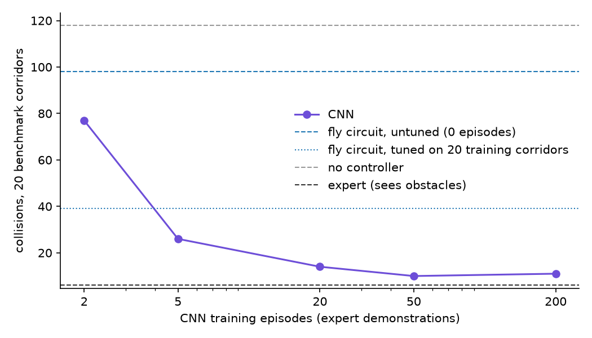

# Fly Circuit vs CNN

Two simulated drones fly the same procedurally generated obstacle corridor:

- **Fly circuit**: a hardwired model of the fruit fly's looming-escape pathway (LPLC2 + LC4 feeding the Giant Fiber). Zero training.
- **CNN**: a small conv net trained to copy a scripted expert's steering, frame in, steering out.

Both see only a downsampled 64x48 grayscale camera frame. Neither has access to obstacle positions or any other scene state. The question: can a circuit with a handful of biologically fixed constants and no training data match a learned network at the one job it evolved for?

Built as an interactive demo for a post on [shauryasharma.tech](https://shauryasharma.tech).

## The model

The circuit follows the static model in Ache et al. 2019, *Current Biology* 29:1073-1081 (STAR Methods eqs 3-7): GF drive is a weighted sum of a log-Gaussian size term (LPLC2, peak at 42 deg), a linear angular-velocity term (LC4), a tonic size-dependent inhibition (sigmoid centred on 66 deg) and a small LC4-dependent inhibitory dip at 26 deg. All constants and weights are the published ones; the paper's sensory delays (11-38 ms) are not modelled. The inhibition can be switched off (`inhibitionEnabled`) for comparison. The escape threshold and steering on top are our own additions.

**Correction (2026-09-17).** Earlier versions divided the LPLC2 exponent by 2·C4 instead of the paper's 2·C4², which made the size tuning too wide, and left out both inhibitory terms. Both are fixed, and every fly number below is from the corrected model. `prototypes/fly_circuit.py` reproduces the paper's shape on a synthetic looming disc: the drive peaks near 42 deg and goes negative (-0.23) once a 90 deg disc is held on screen.

Radial motion opponency (RMO) rejects expansion caused by the drone's own motion. It can be toggled off to show the detector panicking at self-motion.

Angular size is read from the largest connected patch of surviving flow. Flat-shaded surfaces only produce flow at their edges, so that patch is an outline rather than a filled shape; obstacles are solid, so its bounding box is treated as filled and reported as the diameter of a circle with that area. The escape threshold is set at half the peak of the full model's static size tuning (1.20, reached by an object about 26 degrees across), a rule taken from the biology rather than fitted to these corridors.

Caveats: the connectome gives the wiring, not the transfer functions (those come from separate physiology). The published model was fit to a single expanding disc in a lab, so extending it to continuous corridor flight is a modeling choice, not established science.

The CNN (`train/model.py`) takes the last 4 frames stacked (20Hz), has 3 stride-2 convolutions and 2 fully connected layers (~35k parameters), and regresses steering. It is trained by imitation on labels from a scripted expert that is allowed to see obstacle positions; the trained CNN itself sees only frames.

## Results

Benchmark, 20 corridors (seeds 5101-5120), rendered by Three.js:

| condition | collisions | escape frames | avg abs steering |
|---|---|---|---|
| no controller | 118 | 8867 | 0.393 |
| fly circuit | 98 | 7370 | 0.354 |
| fly circuit, no inhibition | 88 | 11655 | 0.452 |
| fly circuit, RMO off | 37 | 28732 | 0.850 |
| fly circuit, tuned | 39 | 10196 | 0.306 |
| expert (sees obstacles, not a contestant) | 6 | - | 0.147 |

("No controller" runs the circuit but ignores its output, so its escape frames and steering are what the circuit would have done.) With RMO off the drone is in escape mode most of the time and avoids obstacles by swerving constantly. The inhibitory terms cost a few collisions (88 to 98) and buy calmer steering (0.45 to 0.35).

**Where the circuit loses** (`npx tsx scripts/diag-detection.ts 10 --three`, which compares what it reported against the real corridor geometry, untuned corrected model): its escapes are reasonably aimed, but it reacts late. Of 3424 escape steps, 46% are at an obstacle it would actually hit, 50% at an obstacle in view that it would have missed anyway, and 4% with nothing in view. It got clear of 50 of the 70 obstacles it was on course to hit, at a median of 3.7 m, and saw 20 (29%) too late or never. Its reported angular size runs about 0.3x the true size, since it only sees edges, and the corrected (narrower) tuning curve needs that reading to reach about 26 deg before it fires, which is the most likely reason it is late. The circuit detects looming, not collision courses, which is right for a fly fleeing a predator and costly for a drone threading clutter.

For comparison, the model with the transcription error escaped from 94% of on-course obstacles at a median of 5.5 m but aimed badly: 17% real threats, 76% obstacles it would miss, 7% nothing in view. On that version, a gate that suppressed objects whose bearing drifts sideways (the constant-bearing collision test) cut escapes from 12041 to 3762 but missed 39% of real threats, up from 6%, and collisions rose from 48 to 111, so it was reverted. It has not been re-tried on the corrected model.

Data efficiency (`python train/curve.py --three`): the CNN trained on N expert episodes (30s of flying each), same step budget and early stopping for every N, one training run per point:

| training episodes | 2 | 5 | 20 | 50 | 200 |
|---|---|---|---|---|---|
| CNN collisions | 77 | 26 | 14 | 10 | 11 |

The untuned fly circuit (98, zero episodes) is already beaten by the 2-episode CNN, one minute of demonstrations. The tuned circuit (39) is beaten between 2 and 5 episodes. Differences below ~5 collisions are within noise at 20 corridors.

Tuning the fly circuit (`npx tsx scripts/tune-fly.ts 100 --three`): random search over its 7 engineering constants on 20 training corridors (the same ones as the 20-episode CNN), published biology constants fixed, scored as collisions + 50 x average steering effort (scoring collisions alone found settings that swerve constantly). Training corridors: 105 -> 38 collisions at 0.31 steering (from 0.36). On the benchmark the tuned circuit gets 39 collisions at 0.31 average steering, versus 98 at 0.35 untuned and 14 at 0.13 for the CNN trained on the same 20 corridors. The search is seeded, and the same trial won as before the correction: the escape threshold goes up to 1.52, the steering gain down to 0.19 and the dodge shortens to 0.16 s.



Seeds (`src/sim/seeds.ts`): train 1-2000, validation 5001-5100 (checkpoint selection), benchmark 5101-5200, held-out evaluation 9000-9099. Nothing trains or tunes on the held-out range.

## Held-out evaluation

`npx tsx scripts/verify-fly-controller.ts train/curve/cnn_*.bin --three --eval` flies all 100 held-out corridors (seeds 9000-9099). Every number above comes from training, validation or benchmark corridors; these are the ones nothing was fitted to.

| contestant | training episodes | collisions | avg abs steering |
|---|---|---|---|
| no controller | - | 665 | (0.385) |
| fly circuit | 0 | 487 | 0.349 |
| fly circuit, no inhibition | 0 | 448 | 0.451 |
| fly circuit, RMO off | 0 | 194 | 0.844 |
| fly circuit, tuned | 0 (20 corridors of tuning) | 241 | 0.313 |
| CNN | 2 | 373 | 0.095 |
| CNN | 5 | 213 | 0.120 |
| CNN | 20 | 81 | 0.133 |
| CNN | 50 | 57 | 0.132 |
| CNN | 200 | 49 | 0.124 |
| expert (sees obstacles, not a contestant) | - | 25 | 0.143 |

Read it as collisions per 100 corridors, each 120 m long:

- The circuit works, weakly: 665 to 487 with no training data at all, about a quarter fewer collisions.
- The CNN passes the untuned circuit with 2 episodes (one minute of demonstrations) and the tuned circuit at about 5.
- Tuning the circuit's 7 engineering constants on 20 training corridors transfers: 487 to 241 collisions with calmer steering. That is a little less than 5 episodes of CNN training data are worth.
- RMO off gets to 194, but only by swerving almost constantly (0.84).
- Nobody is close to the cheating expert (25), which reads obstacle positions directly.

These corridors have been flown twice: once with the transcription error, where the fly scored 288 untuned and 195 tuned, and once after fixing it. Nothing was tuned or selected on them either time. The CNN rows did not change.

## Layout

```
src/sim          corridor generation, drone kinematics, collisions, seed split (no DOM)
src/controllers  flyCircuit.ts and cnn.ts: frames in, steering out
src/render       Three.js scene and the drone's 64x48 camera
src/widget       browser entry point
src/bench        headless page (bench.html) that runs episodes on the real renderer
scripts          data generation, benchmark, tuning; --three runs them in headless Edge, otherwise a fast analytic harness
train            CNN model and training (PyTorch)
prototypes       Python prototype of the circuit
```

## Run

```bash
npm install
npm run dev                                   # browser demo
npx tsx scripts/verify-fly-controller.ts --three   # headless collision benchmark
python prototypes/fly_circuit.py                   # synthetic looming-disc check
```

Train the CNN and reproduce the results (one `--three` job at a time; they share a Vite server setup):

```bash
npx tsx scripts/gen-episodes.ts 200 --three        # data/*.npy rendered by Three.js
python train/train.py 20                           # trains, exports public/cnn.bin
npx tsx scripts/check-cnn.ts                       # TypeScript forward pass matches PyTorch
npx tsx scripts/tune-fly.ts 100 --three            # data/tuning.json
python train/curve.py --three                      # curve models, benchmark, plot
npx tsx scripts/diag-detection.ts 10 --three       # what the circuit saw vs the real geometry
npx tsx scripts/verify-fly-controller.ts train/curve/cnn_2.bin train/curve/cnn_5.bin \
  train/curve/cnn_20.bin train/curve/cnn_50.bin train/curve/cnn_200.bin --three --eval
```

A `--three` run drives a headless browser, so close the `npm run dev` preview first: a widget tab rendering in the background roughly doubles how long these take.

## Embedding in the blog

`npm run build:embed` writes `dist/flyvscnn.js` (600 kB, 136 kB gzipped, Three.js included). The bundle mounts itself
into every `[data-fly-vs-cnn]` element on the page and brings its own styles, which inherit the host's fonts and follow
its light/dark theme. It runs only while it is on screen and the tab is visible, so a post that scrolls past it costs
nothing. Refresh the copies in the blog repo with:

```bash
npm run build:embed
cp dist/flyvscnn.js  ../log/vendor/flyvscnn.js
cp public/cnn.bin    ../log/assets/flyvscnn-cnn.bin
```

The post body then carries one line, and `POST_BUNDLES` in the blog's `build.py` maps that post's slug to
`vendor/flyvscnn.js` so only that page loads it:

```html
<figure>
  <div data-fly-vs-cnn data-weights="assets/flyvscnn-cnn.bin"></div>
  <figcaption>...</figcaption>
</figure>
```

`dev/flyvscnn-embed.html` in the blog repo is a scratch page that loads the bundle under the site's real
Content-Security-Policy, for checking the embed without publishing a post.
